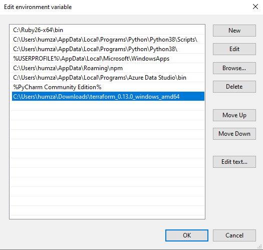

#Infrastructore as code with terraform

# what is terraform

there are 2 sides of IAC
- 1: configuration management
- 2: Orchestration

Ansible -Configuration management
Terraform - Orchestration 
Kubernetes - orchestration is used in containerisation - docker, crio, rocket

Terraform
- Terraform files are created with .tf

-commands
    terraform init - initialises terraform in your project directory 
    terraform plan - checks the steps inside the code and lists success or errors 
    terraform apply - runs the main.tf filer 
    
    
    
    
# How to create EC2 instance using AMI image and Terraform - WINDOWS

- Download Terraform 

- Once downloaded, extract the folder to where you want the Terraform.exe

- Run it as admin

- Now you need to set the PATH environment variable 

Open your setting 

Once in setting, type into the search box, "advanced setting" and click on the View advanced system settings

Once here click on Environment Variables

Once inside, scroll to your path variable and double click on it 

Add the folder URL to the environment variable

Once this is done, exit out of the settings and open up your git bash, 

type in - terraform --version - to check if terraform has been installed correctly

You have now set your PATH variable, you can now create with Terraform 

# To create an instance

Create two files
- main.tf
- variables.tf

Inside the main file you want to begin with provider the and region
    
    provider "aws" {
    
    region = "eu-west-1"
    
    }

Then the image, instance type and the security group

    resource "aws_instance" "app_instance" {
    
      ami = "ami-01561b0b028f2d8de"
      
      instance_type = "t2.micro"
      
      associate_public_ip_address = true
      
      vpc_security_group_ids = [
      
        aws_security_group.ami_sec_group.id]
        
      tags = {
      
        Name = "Eng67.Humza.Terraform.Web"
      }
    }
    
Now the Instance has been made, we need to create a vpc   

    resource "aws_vpc" "terra_vpc" {
    
      cidr_block       = "200.160.0.0/16"
      
      enable_dns_support = "true"
      
      enable_dns_hostnames = "true"
      
      enable_classiclink = "false"
      
      instance_tenancy = "default"
    
      tags = {
      
        Name = "Eng67.Humza.Terraform.VPC"
        
      }
    }
    
Then the Internet Gateway, to allow internet access into the VPC 
    
    resource "aws_internet_gateway" "gw" {
      vpc_id = aws_vpc.terra_vpc.id
    
      tags = {
        Name = "Eng67.Humza.Terraform.Internet.Gateway"
      }
    }
    
Now the subnets to partition the VPC into a two tiered architecture      

    resource "aws_subnet" "public_subnet" {
      vpc_id     = aws_vpc.terra_vpc.id
      cidr_block = "200.160.5.0/24"
    
      tags = {
        Name = "Eng67.Humza.Terraform.PublicSubnet"
      }
    }
    
   
    resource "aws_subnet" "private_subnet" {
      vpc_id     = aws_vpc.terra_vpc.id
      cidr_block = "200.160.10.0/24"
    
      tags = {
        Name = "Eng67.Humza.Terraform.PublicSubnet"
      }
    }
    
Now the route table, to configure the route in and out of the public subnet 
    
    resource "aws_route_table" "public_route_table" {
      vpc_id = aws_vpc.terra_vpc.id
    
      route {
        cidr_block = "0.0.0.0/0"
        gateway_id = aws_internet_gateway.gw.id
      }
    
      tags = {
        Name = "Eng67.Humza.Terraform.Public.Route.Table"
      }
    }
    
In Terraform we need to attach the public Subnet to the VPC 

    resource "aws_route_table_association" "public-association" {
      
      subnet_id      = aws_subnet.public_subnet.id
      
      route_table_id = aws_route_table.public_route_table.id
    }

Now this is done, we need to configure the security group for the EC2 Instance 

    resource "aws_security_group" "ami_sec_group" {
    
      name = "ami_sec_group"
      
      description = "allow traffic in"
      
      vpc_id = var.vpc_id
    
      ingress {
      
        description = "allow inbound traffic"
        
        from_port = 80
        
        protocol = "tcp"
        
        to_port = 80
        
        cidr_blocks = ["0.0.0.0/0"]
        
      }
      ingress {
        description = "allow inbound traffic"
        
        from_port = 22
        
        protocol = "tcp"
        
        to_port = 22
        
        cidr_blocks = ["86.4.83.36/32"]
        
      }
    
      egress {
      
        from_port = 0
        
        protocol = -1
        
        to_port = 0
        
        cidr_blocks = ["0.0.0.0/0"]
        
      }
      tags = {
      
        Name = "Eng67.Humza.Terraform.PublicSubnet"
        
      }
    }
    
    
Now you have created the Terraform files, open your GitBash 
Navigate to your Terraform folder and type
    
    terraform init
    
Initialized terraform inside your projects folder, then type

    terraform plan 

Is used to create an execution plan. It will display the changes made to your main.tf file as seen below:

Now to apply the changes you have created by using plan this is done by:

    terraform apply
    

This applies the changes to AWS

You have now created a EC2 instance from an AMI image, with a VPC + Subnet + Route Table + Internet Gateway and security group!